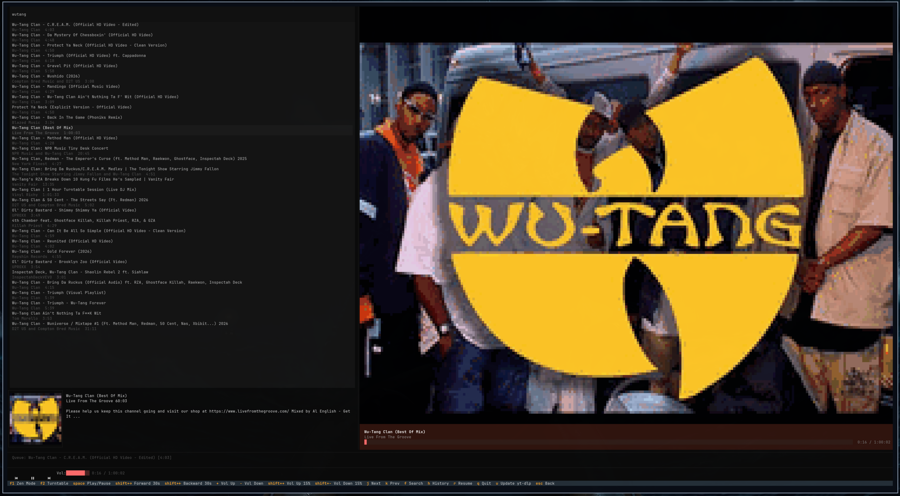

# zenplayer

A terminal-based YouTube Music client with album-art now-playing display, bass-reactive glow, and session persistence.



## Features

- Search & play YouTube music directly from the terminal
- Album art now-playing with title/artist/progress-bar overlay
- Album art turntable mode
- Bass-reactive glow (40–240 Hz FFT)
- Full-screen search with debounced async results and preview sidebar
- mpv-backed playback with seek, volume, pause, next/previous
- Clickable controls (prev/play/next)
- Volume persistence
- Play history with resume-from-position
- Session persistence — resume where you left off
- Zen mode — minimal full-screen view
- Thumbnail caching for instant replays
- Customizable ASCII splash screen

## Requirements

- Python 3.11+
- [mpv](https://mpv.io/) — audio playback engine
- A truecolor-capable terminal for full-quality album art (falls back gracefully otherwise)

### Optional (for bass-reactive glow)

- [PulseAudio](https://www.freedesktop.org/wiki/Software/PulseAudio/) — `pactl` and `parec` are used to capture live audio for the FFT bass analysis. Without these, the bass-reactive glow is disabled but all other features work.

## Install

```bash
pip install zenplayer
```

Or from source:

```bash
git clone https://github.com/bjornramberg/zenplayer.git
cd zenplayer
pip install .
```

### Platform-specific mpv install

```bash
# macOS
brew install mpv

# Ubuntu / Debian
sudo apt install mpv

# Arch
sudo pacman -S mpv

# Fedora
sudo dnf install mpv
```

## Usage

```bash
zenplayer
```

The search bar is focused on startup — just start typing to search. Press `escape` to unfocus it and use keyboard shortcuts.

### Keyboard shortcuts

| Key | Action |
|---|---|
| `space` | Play / Pause |
| `→` / `←` | Seek forward / backward 5s |
| `shift+→` / `shift+←` | Seek forward / backward 30s |
| `shift+↑` / `shift+↓` | Volume up / down |
| `n` / `p` | Next / Previous track |
| `/` | Focus search input |
| `h` | Toggle history screen |
| `r` | Resume last session |
| `f1` | Toggle zen mode |
| `f2` | Toggle turntable mode |
| `enter` | Play selected track (history) |
| `backspace` / `delete` | Remove history entry |
| `ctrl+u` | Clear all history |
| `q` | Quit |
| `escape` | Unfocus search / Close overlays |

### Splash screen

On startup and shutdown, a 2-second splash shows the zenplayer ASCII art centered on screen with a fade-in/fade-out effect. Skip it with `--debug`:

```bash
zenplayer --debug
```

## Configuration

`~/.config/zenplayer/config.json`:

```json
{
  "volume": 50,
  "reactive_fps": 24,
  "search_limit": 30,
  "history_limit": 100
}
```

| Key | Description | Default |
|---|---|---|
| `volume` | Initial volume (0–100); updated in-app and persisted | `50` |
| `reactive_fps` | How often the bass analysis runs and the glow updates | `24` |
| `search_limit` | How many results each search fetches | `30` |
| `history_limit` | Max entries stored in play history | `100` |

## Data files

| Path | Contents |
|---|---|
| `~/.config/zenplayer/config.json` | Volume, FPS, limits, last session |
| `~/.cache/zenplayer/thumbs/` | Cached YouTube thumbnails |
| `~/.cache/zenplayer/history.json` | Play history with positions |
| `~/.cache/zenplayer/search/` | Cached search results (JSON, 5min TTL) |

## License

MIT
